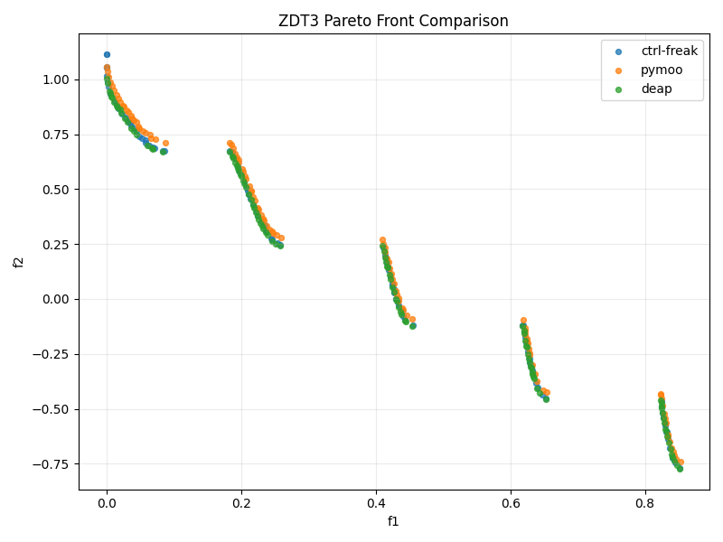

# NSGA-II Benchmarks

Benchmark suite comparing ctrl-freak against Pymoo and DEAP on standard multi-objective optimization test problems.

## Test Problems

### ZDT Suite

The ZDT (Zitzler-Deb-Thiele) test problems are standard benchmarks for multi-objective evolutionary algorithms:

| Problem | Pareto Front | Characteristics |
|---------|--------------|-----------------|
| ZDT1 | Convex | Continuous, 30 variables |
| ZDT2 | Concave | Non-convex front, 30 variables |
| ZDT3 | Discontinuous | Multiple disconnected segments |

All problems have:

- Decision variables in [0, 1]
- Two objectives to minimize
- Known analytical Pareto-optimal fronts

## Methodology

### Algorithm Configuration

All libraries configured with identical parameters:

| Parameter | Value |
|-----------|-------|
| Population size | 100 |
| Generations | 250 |
| Decision variables | 30 |
| Bounds | [0, 1] |
| Crossover | SBX (eta = 15) |
| Mutation | Polynomial (eta = 20, prob = 1/30) |
| Runs per config | 10 (seeds 0-9) |

### Metrics

- **Hypervolume (HV)**: Volume of objective space dominated by the Pareto front approximation (higher is better)
- **Reference point**: [1.1, 1.1] for all ZDT problems
- **Time**: Wall-clock seconds per run

## Results

Results are produced by running `benchmarks/zdt/run_benchmark.py`. Regenerate benchmark results after operator changes, including crossover or mutation updates, before publishing or comparing numbers.

### Visual Comparison



*ZDT3 discontinuous Pareto front: ctrl-freak and DEAP closely track the true front, while Pymoo shows visible scatter.*

## How to Run

```bash
# Run full benchmark suite
uv run python benchmarks/zdt/run_benchmark.py

# Results saved to benchmarks/zdt/results/benchmark_results.json
```

## References

1. Zitzler, E., Deb, K., & Thiele, L. (2000). Comparison of multiobjective evolutionary algorithms: Empirical results. *Evolutionary computation*, 8(2), 173-195.

2. Deb, K., Pratap, A., Agarwal, S., & Meyarivan, T. A. M. T. (2002). A fast and elitist multiobjective genetic algorithm: NSGA-II. *IEEE transactions on evolutionary computation*, 6(2), 182-197.
