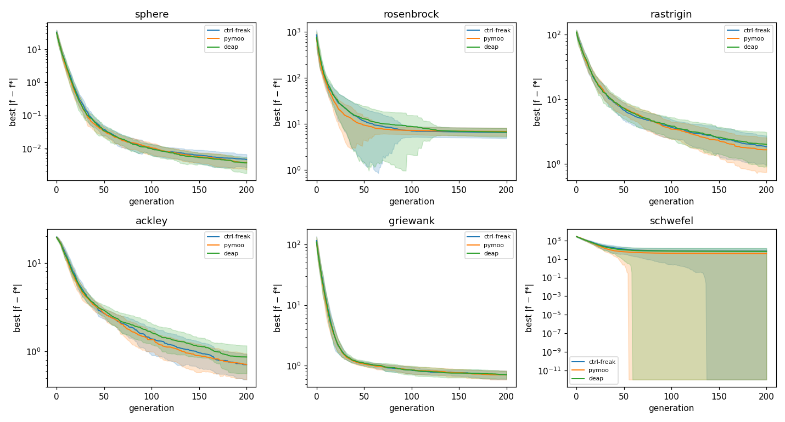
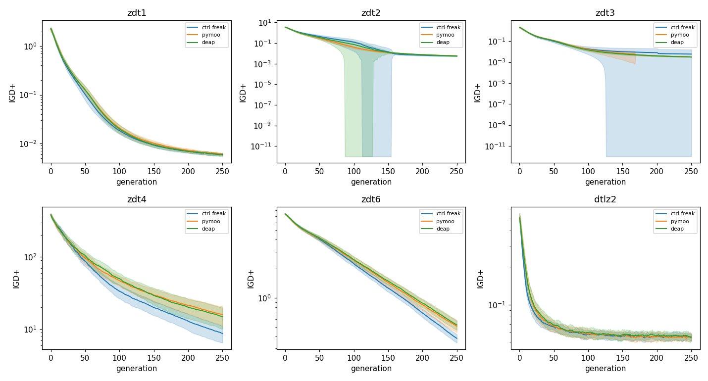
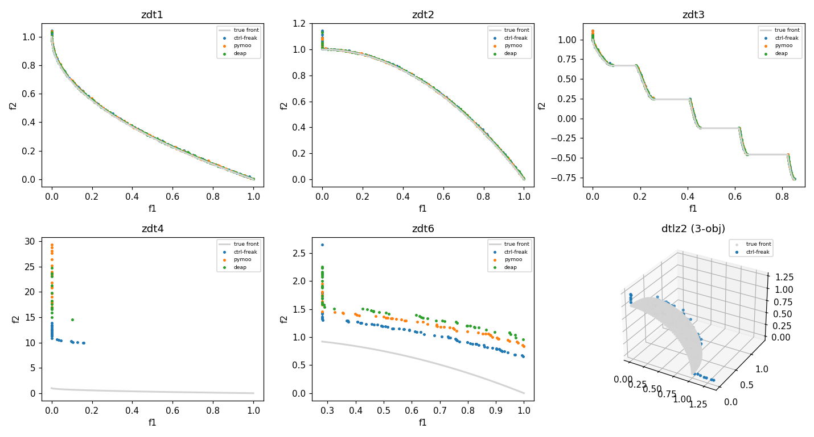

# Validation

This page is the citable summary of ctrl-freak's validation benchmark suite. The
suite exists for **scientific trust**, not marketing: when a manuscript states that
parameters were calibrated with ctrl-freak's `ga()` / `nsga2()`, a reviewer should
have no grounds to doubt the optimizer. The claim it substantiates is **parity** —
across standard problems with known optima, ctrl-freak's results are statistically
indistinguishable from [pymoo](https://pymoo.org) and
[DEAP](https://deap.readthedocs.io). The full, auto-rendered report (every table
and figure, regenerated from the committed results JSON) lives in the repository:
[benchmarks/README.md](https://github.com/hydrosolutions/ctrl-freak/blob/main/benchmarks/README.md).

## Methodology

- **Problems.** Six single-objective functions with known global optima (Sphere,
  Rosenbrock, Rastrigin, Ackley, Griewank, Schwefel, all 10-D) and six
  multi-objective problems with analytical Pareto fronts (ZDT1, ZDT2, ZDT3, ZDT4,
  ZDT6 at 30 variables; DTLZ2 at 3 objectives / 12 variables).
- **Identical algorithm across libraries.** All three libraries run the **same**
  genetic algorithm: ctrl-freak's exact single-child, every-eligible-variable SBX
  crossover (eta 15) is *ported* into custom pymoo and DEAP operators, polynomial
  mutation (eta 20, one expected gene flip per genome) is applied to every
  offspring, and tournament selection / elitist (SO) and NSGA-II (MO) survival are
  aligned. The evaluation budget is identical to the evaluation call
  (SO: 20 100 evaluations; MO: 25 100). The comparison therefore isolates the
  **algorithm**, not the configuration.
- **Statistic.** Parity is an *equivalence* claim, so it is adjudicated by
  **overlapping variance**: ctrl-freak and a baseline are equivalent for a given
  problem and metric when the gap between their means is smaller than the larger
  per-seed standard deviation (a non-significant difference test would not be
  sufficient). Each cell reports the verdict and its margin. Thirty seeds.

<!-- BEGIN:provenance -->

| Field | Value |
|---|---|
| Seeds | 30 (0–29) |
| ctrl-freak | 0.2.0 |
| pymoo | 0.6.1.6 |
| deap | 1.4.3 |
| numpy | 2.4.1 |
| SO budget | pop 100 × 200 gen (20100 evals) |
| MO budget | pop 100 × 250 gen (25100 evals) |
| SBX / PM eta | 15.0 / 20.0 |

<!-- END:provenance -->

## Result

Single-objective parity is led by the continuous error metrics |f − f*| and
‖x − x*‖: ctrl-freak is statistically indistinguishable from both baselines on all
six problems, including the multimodal Rastrigin, Ackley, and Schwefel.

<!-- BEGIN:so_objective_error -->

| Problem | ctrl-freak | pymoo | deap | vs pymoo | vs deap |
|---|---|---|---|---|---|
| sphere | 4.61e-03 ± 1.99e-03 | 3.68e-03 ± 1.39e-03 | 3.63e-03 ± 1.86e-03 | equivalent (margin +1.1e-03) | equivalent (margin +1.0e-03) |
| rosenbrock | 6.58e+00 ± 1.65e+00 | 6.90e+00 ± 1.39e+00 | 6.72e+00 ± 1.46e+00 | equivalent (margin +1.3e+00) | equivalent (margin +1.5e+00) |
| rastrigin | 1.84e+00 ± 8.87e-01 | 1.65e+00 ± 9.06e-01 | 1.99e+00 ± 1.10e+00 | equivalent (margin +7.1e-01) | equivalent (margin +9.4e-01) |
| ackley | 7.10e-01 ± 2.29e-01 | 7.12e-01 ± 2.32e-01 | 8.67e-01 ± 3.01e-01 | equivalent (margin +2.3e-01) | equivalent (margin +1.4e-01) |
| griewank | 7.11e-01 ± 1.18e-01 | 7.09e-01 ± 1.19e-01 | 7.10e-01 ± 1.02e-01 | equivalent (margin +1.2e-01) | equivalent (margin +1.2e-01) |
| schwefel | 7.04e+01 ± 7.27e+01 | 3.84e+01 ± 5.47e+01 | 6.62e+01 ± 8.51e+01 | equivalent (margin +4.1e+01) | equivalent (margin +8.1e+01) |

<!-- END:so_objective_error -->

Multi-objective convergence (IGD+ to the analytical front) is statistically
indistinguishable from both baselines on ZDT1, ZDT2, ZDT3, and DTLZ2, on all three
metrics (IGD+, GD, hypervolume).

<!-- BEGIN:mo_igd_plus -->

| Problem | ctrl-freak | pymoo | deap | vs pymoo | vs deap |
|---|---|---|---|---|---|
| zdt1 | 5.85e-03 ± 3.75e-04 | 6.07e-03 ± 3.63e-04 | 5.94e-03 ± 4.22e-04 | equivalent (margin +1.5e-04) | equivalent (margin +3.3e-04) |
| zdt2 | 5.46e-03 ± 4.38e-04 | 5.87e-03 ± 3.77e-04 | 5.69e-03 ± 4.77e-04 | equivalent (margin +2.7e-05) | equivalent (margin +2.4e-04) |
| zdt3 | 5.91e-03 ± 1.02e-02 | 3.17e-03 ± 2.63e-04 | 3.14e-03 ± 2.22e-04 | equivalent (margin +7.4e-03) | equivalent (margin +7.4e-03) |
| zdt4 | 8.73e+00 ± 2.26e+00 | 1.59e+01 ± 4.68e+00 | 1.48e+01 ± 4.73e+00 | not equivalent — ctrl-freak better | not equivalent — ctrl-freak better |
| zdt6 | 3.81e-01 ± 3.88e-02 | 5.08e-01 ± 6.77e-02 | 5.25e-01 ± 6.04e-02 | not equivalent — ctrl-freak better | not equivalent — ctrl-freak better |
| dtlz2 | 5.47e-02 ± 3.67e-03 | 5.43e-02 ± 3.61e-03 | 5.47e-02 ± 3.28e-03 | equivalent (margin +3.3e-03) | equivalent (margin +3.6e-03) |

<!-- END:mo_igd_plus -->

### Two documented exceptions

The "statistically indistinguishable" sentence has two honest exceptions, both
recorded because the suite reports faithfully rather than selectively:

- **ZDT4 and ZDT6.** None of the three libraries converges on these hardest
  multimodal / biased problems at this budget; the symmetric variance test flags
  the gap, but **in ctrl-freak's favour** — ctrl-freak's IGD+, GD, and hypervolume
  are at least as good as both pymoo and DEAP. The parity / trust claim is not
  threatened (ctrl-freak is at-least-as-good); the clean equivalence sentence
  simply does not apply where no library converges. (ZDT4's hypervolume is `0` for
  all three because every final front lies outside the `[1.1, 1.1]` reference box.)
- **Single-objective success rate is `0` for every problem and every library.** The
  committed ε thresholds are strict (e.g. Sphere ε = 1e-6 while all three reach
  ~4e-3 at this budget), so the binary success metric is uniformly zero. This is a
  documented **strict-threshold non-convergence property at this budget**, not a
  failure: the three libraries reach the same error band, and the parity evidence
  rests on the continuous error metrics above.

## Figures

Seed-mean convergence with a ±std band, three libraries:

Final non-dominated fronts against the analytical true fronts (ZDT4/ZDT6 sit off
the front for all three libraries — the documented exceptions; the DTLZ2 panel
shows ctrl-freak against the unit-sphere octant, with per-library parity quantified
in the report's IGD+/GD/HV table):

